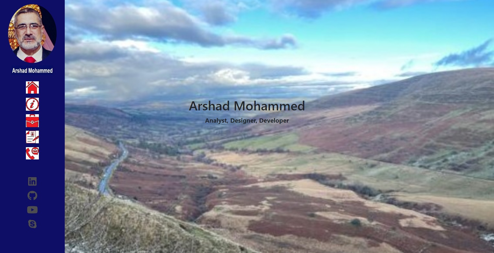
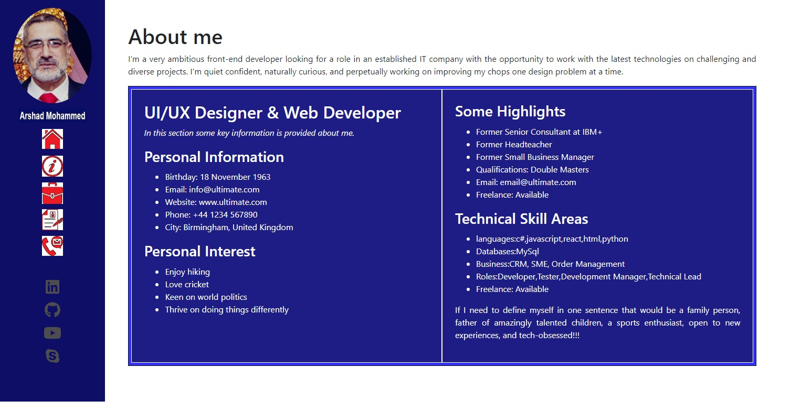
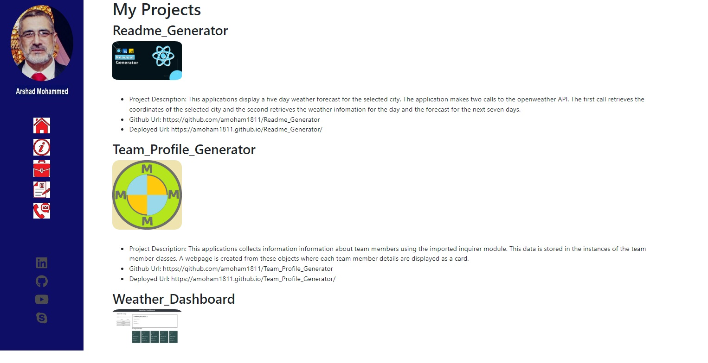
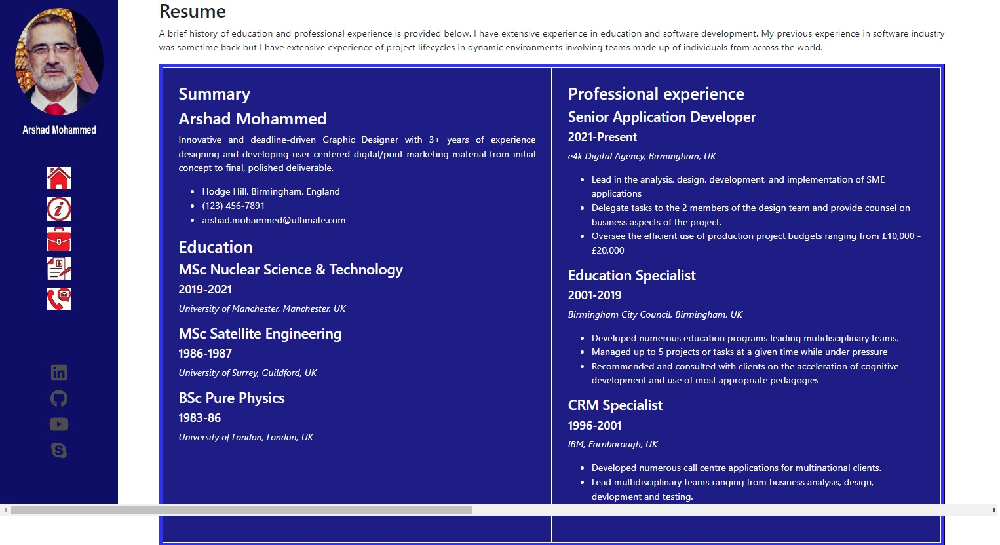
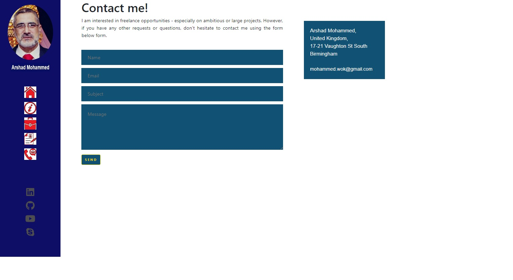

# MyPortfolio
This project is intended to provide an introduction to the frontend developer. This project is developed using react technologies and using components and routing along with many other features such as hooks, emailjs, etc. The portfolio showcases the educational and technical background and provides access to some of the projects completed by the professional to gauge the technical skills. The portfolio is divided into five sections as follows:

1. **Home** - Title page with navigation
2. **About** - Snapshot of developers background and contact details.
3. **Projects** - List of developers projects available for public viewing.
4. **Resume** - More detailed account of education and career.
5. **Contact** - Provides some contact details.

## Home Page
The homepage provides a small image of the developer in the left hand panel. The user can click on the links provide in the left hand panel to navigate to the desired section e.g. click on "Resume" to navigate to the resume section (see image below). In addition to this links are also provided to developers linkedIn profile, github pages,etc. 

## About Page
This page provides a developer snapshot. There is a small photo of the developer together with some personal and contact details. There are brief summary of past achievements and interest. The page images is provided below:

## Projects
This is perhaps the most important part as it provides links to the most recent projects completed by the developer and provides an insight into the skills possessed by the developer for potential clients or employers. This page was produced using several components and react technologies. 

## Resume Page
This page displays the highest levels of educational qualifications held by the developers and it also provides details of the most relevant jobs held.

## Contact page
Multi channel contact details for the developer are provided in this section. There is also a form to send a email messages to the developer using EmailJs technologies.

## Future Developments
The contact page displaying a map location using google maps would complement the address details for anyone wishing to visit or simply to have an idea of the geographical location. Some animation could be added to make the pages come alive. Finally, additional pages could be added to provide additional information e.g. display developer skills and proficiency.

This project was put together using react components and made use of html, css, fortawesome fonts and icons, hooks, EmailJs and many other technologies. The project shows how react technologies can render a sophisticated application using minimal codde.

## Github Repository
The project can be viewed at:
https://github.com/amoham1811/Portfolio-React

and it requires the implementation of node to view the application.